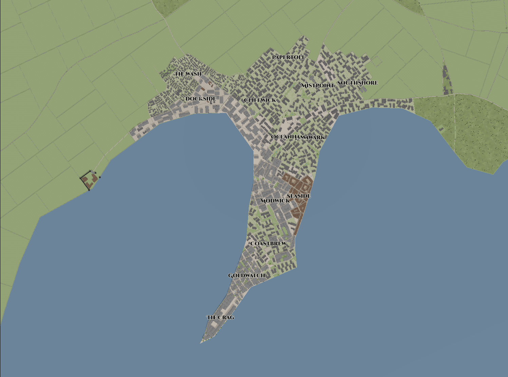

# City: Northanchor (or North Anchor, or Norank)

<!-- HTML goes here -->

<!-- end HTML -->

 
<i> A view of Seaside, the harbor and associated neighborhood on Crag's east flank </i>
 
 



## Map

 

## Early History of Northanchor  

North Anchor was founded in 276 K.E. by the Imperial Navy to serve as a resupply point for the Navy's young but growing northern navy. The earliest residents consisted of stationed military and a minimal number of non-soldiers to maintain operation. By 281 K.E. drydock facilities had been built and with it growing civilian population based around a growing military and merchant ship repair and building industry fueled by the mostly untouched timber supply in the surrounding hills.

In 289 K.E., the resupply post had grown from a few dozen households to almost a city of over one thousand people living in a mostly unplanned an quickly degrading urban environment. The Royal Engineer of the Imperium, Kyoni Jikran, was directed by the high Admiral of the North Seas to design a new plan for the growing city. In the following year land clearing began and ground was broken on what would become the first of the Imperial Jikrans, the geometrically planned cities that would be become synomomous with Kaldrinic expansion through the 4th and 5th centuries.

## City Layout

Many of the aspects common to later Jikrans were first implemented in Northanchor. The urban core of the city is surrounded by a set of walls in an oval shape, with the longer axis of the oval aligned approximately in the direction of Ashenstone. Four main gates lead in and out of the city, one at the end of each axis. Each gate is built like a small fortress, designed to not only protect the gate from attackers but also be able to support a legion of soldiers under seige for up to one month without support.

At the center of the oval is the main forum, a plaza surrounded by green space, monuments, and cloisters that are open to the public. Offset from the center on the side away from Ashenstone is the fortified city command, a fortress often with its own independent set of walls that hosts the home for the city's governor and often any locally stationed military leaders or other imperial officers. The design of the central fortress varies between Jikrans depending on topography, contemporary castle engineering, and the tastes of the governor overseeing construction. In the case of Northanchor the fortress is laid out symetrically, the favored style of Kyoni Jikran. It has a moat, an outer bailey, an an inner bailey before the monumental central keep placed upon an artifical hill that affords views over the city to the sea.

The rest of the city is divided into major districts defined by the long and short axis of the city plan. The northeastern district of Northachor, Dockstrand, is closest to the naval port and military operated drydocks. The southeastern district, Portside, butts up against the civilian portions of the port and thus host more inns, taverns, and merchantile businesses that benefit from proximity to the wharfside warehouses. The western districts are less specialized and represent a more standard city.

Outside the city to the west lie a mix of farmfields and small maintained wood lots. Residences in the area within a few miles of the city are sparse, as an emphasis is made for residents to live within the city walls. Northanchor, like later Jikrans, is under strict land management and planning by the governor that limits development outside the city walls, instead focusins on densification within the walls where appropriate. However, since residency is controlled almost exclusively by local authorities, the nearby settlements of Outanchor and Grenthim become defacto slums for the less desirable members of society that Northanchor authories deem to not fulfill an appropriate role in the city's functions.

## Notable Residents

