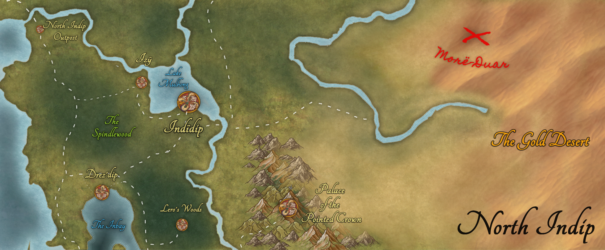

# Session 4 - June 4th 2025
> June 4th 2025

## Post Lightsong battle:

- Felu lies in a magical limbo/stasis between life and death on the Church/waypoint floor.
- The party rummaged through Felu's things.
- Boudicca got the Cursemark of the Ildarii-slayer.
- Darkvision lost, party has disadvantage on charisma checks. Red, bloodstained hands.
- Bolete comes back from foraging to find Felu on the floor. Oops.
- Bolete got a red blinking stone from Felu's pocket.
- Torin took Felu's Deepseeker Glaive. (can push and pull graxil)
- Indarhan got a map pointing out the location of a place called Morë-Duar and annotations from Felu's cousin Sylphrena.
- Indarhan determined his fireball gun can be upgraded without too much difficulty to get an extra charge.
- Jruq Oldebags was spooked, but relinquished the Jeffs (two donkeys) and a magic item to someone (I'll have to check the character sheets, I forget)
- Shifty, half-orc adventurer of the North Indip Outpost joins the party (Hi August).
- A dark aura around Felu's body whispers "More-Duar yei lorn", the same text on the map showing the desert.

## On the road / Flaighleigh the Grackle

- Unlike the previous day, exceptionally beautiful out, in a radius centered around the church. Haven't seen such a nice day since the Shadow Plague began.
- The clouds part unnaturally in a circle. Sunny and birdsong in center where you are. You do see the clouds moving back in again.
- Walking down the road, you see a sign: South to the Spindlewood, East to Izy.
- By the sign is a hill overlooking the entrance to the Spindlewood, a bright and young forest with straight trees.
- Intricate 100-200 year old Dwarvencraft stone stairs lead to the top of the hill.
- At the top you perceive a bird - a Grackle - the size of Black Bear.
- The bird talks, and already knows all of you by name. He also calls everyone "niece" or "nephew".
- He is bound by a bear trap.
- Torin frees him and the bottom half of his leg falls off "ah it will regrow".
- Bolete heals Flaighleigh's stub and Flaighleigh thanks her.
- The party shows Flaighleigh Felu, who hisses, and refuses to speak on matters of the Graxils and the Ildarii, calling the latter "Interlopers".
- Torin asks his Axe who the Graxil are, and he says spirits that must not be allowed to reach Ashenstone City. Ashenstone is holding out just fine, so no worries there (for now). (Nat 1, he gets the bare minimum)
- Boudicca rolls better and learns that Ilyenu tried sealing away the old enemy but as a side effect created the Graxil (there's more here but you'll need to progress or get better Wisdom rolls).
- Indarhan asks the Grackle if he's some elder god, and in exchange, the Grackle stares and sends Indarhan a sublime vision of a Starry Expanse, confirming that yes he's something of some deific nature, but as Indarhan did not roll a nat 20 insight check, he did not ascertain exactly what the bird is.
- The Grackle says his name is Flaighleigh and that he'd be happy to help you if you give him your soul, so to speak.
- He reiterates that this is figurative, and really just wants to make a pact.
- Boudicca agrees and gets Flaighleigh's Winds, the ability to teleport fallen party members to her, and Flaighleigh's Flute, which let's you talk to him once a day. In exchange, Boudicca needs to level up into Warlock class Pact of the Fathomless.
- Flaighleigh flaps his wings to leave, and then helps the party get to Izy by using his winds to teleport them to another Dwarven Stair Circle 40 miles or so east.

## Arriving in Izy 
- The party arrives in Izy with the Jeffs and Felu.
- They go to the stables to tie up the Jeffs but the stable mistress, Lady Inte La-Çom, is horrified by Felu's dead body. Also, you don't do great on persuasion rolls so she calls for the guards.
- Seeing the commotion and the Ildarii on Jeff's back, Ingwë and his niece Indis, Elven armorers, beckon the party to come with them. Ingwë has a few words with the guards and defuses the situation, leading you back to his Armory/blacksmith shop.
- There is some hubbub in town but generally you didn't make too much of a scene, thanks to wise Ingwë.

Until next time!