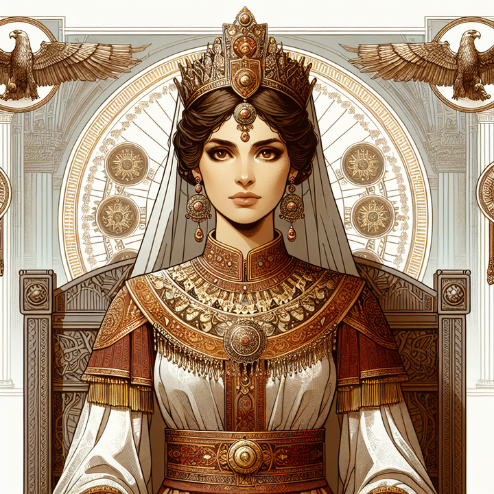

# World Timeline

_Major events of the world._

## Primeval History 

| Year  | Event | Picture |
|------:|:------|:--------|
| ? BKD | The Ulso arrive within the Circles of the World, making the first moon, Aldarma, their home. | | 
| ? BKD | The Lesser Ulso rebel against the Greater, but are utterly annihilated. | | 
| ? BKD | The Ildarii arrive within the Circles of the World, making the second moon, Rannath, their home. | |
| ? BKD | The Greater Ulso adopt the Ildarii into the long-empty ranks of the Lesser Ulso and give them leave to descend to the surface. | | 
| By 12,012 BKD | The Ildarii Temple Cities are founded by the Four Orders on the surface of the planet, in the Northern Hemisphere. | |

## The Eon of the Long Dark

| Year  | Event | Picture |
|------:|:------|:--------|
| ~ 10,000? BKD | The beginning of the War of Descension. The Dark Ulso Nearanu takes Rannath for his own, darkening the moon and expelling the Ildarii. | | 
| ~ 6,666 BKD | The end of the War of Descension. The Dark Moon, now called *Morě-Duar* ("Dark Second") by the Ildarii and *Neara* by the servants of Nearanu, collides with the surface of the Planet. |  | |
| ~ 4,000 BKD | End of the Long Dark. Terrestrial Ildarii society has by this point collapsed, their memory faded to myth, and the temple cities abandoned to The Elves. | | 
| 3,965 BKD | Settlement that becomes Taynuilt is founded on the new coast. | |
| 3,700 BKD | First of the Kyver (Dwarves) come out of hiding | |

## Classical Pre-Kaldrinic History

| Year  | Event | Picture  |
|------:|:------|:---------|
| -982 | The High Orcish Necromancer-kings L'ratomi and Z'ratomi begin The Inquistion of the Horns, , triggering the great Northward migration of the Unhorned along the Western rim of the Gold Desert. It is said that a great and terrible artifact enabled their sudden surge, but no such artifact was ever found.  | |
| -904 | *Trag Çom Anatala I* declares the Ley-Indip-Ley or Indipian Empire, upon the death of her father, the Fu-Ley of Mulloch-Izyal. Anatala adopts the title Fu-Indip-Ley ("First Servant of Indip's land"), which becomes the title for all Indipian Emperors and Empresses until the collapse of the Empire. |  | 
| -834 | The City of Invëye is founded on the southern coast of Indip. It quickly grows to be the largest in Indip and the known world, becoming known as Great Invëye. | | 
| -800 | The Indipian Empire constructs The Watergates - great mobile naval weapons - to defend against the Third Orcish Deadfleet |  | |
| -797 | Anatala I's great-granddaughter *Trag Çom Alayana II* leads the host that finally defeats the Necromancer Kings, obliterating the Third Orcish Deadfleet with the full power of the Watergates. The Watergates lose significant arcane power after this event. | |
| -700s| After the long-sought demise of the Orcish Necromancer Kings, the Orcs revert to a more primitive society and the Indipian Empire becomes the foremost power in the Northern Lands. The Indipian navy begins projecting Power across the Jewel Sea, backed by the Watergates. | |
| -581 | With the support of many other nations the King of Taynuilt forms and heads the first Taynish Confederacy in light of enemy provocations to the East. | |
| -338 | The Incrillans are forced from their homeland and begin settling on Ekryp. | | 
| -332 | The second Taynish Confederacy forms to defend against the regime of *Tan La Fon V*, the last Fu-Ley of Unified Indip. | |
| -326 | After *Tan La Fon V*'s navy is defeated, the Indip Empire divides between North and South, no longer able to hold together in the face of building internal power struggles. The ensuing chaos effectively ends the war between Indip and the Second Taynish Confederacy. The First Darkening of the Watergates occur, making the ancient weapons less reliable than they once were.| |
| -324 | With the collapse of the Unified Indipian power structure, the Second Taynish Confederacy disbands according to the initial treaty. | |
| -206 | Czerk Hritte Lan I leads a successful rebellion of the Mul against the North Indip Empire, liberating the lands north of the Mul River and leading to the establishment of the Second Kingdom of Mul. | |
| -205 | Great unchecked fires burn-out the Hall of the Chieftans and much of Indïdip, the capital of North Indip. The North Indip Empire falls unceremoniously. Mysteriously, this event coincides with the final Darkening of the Watergates hundreds of miles south in Great Invëye, leaving South Indip without its historical naval trump-card. | |
| -204 | Founding of Izÿ on Lake Mulhong by refugees from Indïdip. | |
|   -4 | The dual catastrophy of the eruption of Mount Iljo and the breaking of the Gods' Dam lead to the migration of Emperor Jontosin and his people north by ship to find new lands. The Denisians, also impacted by the catastrophy, begin to migrate north too. | |
|   -3 | Emperor Jontosin's fleet is attacked by Orcs from the Rock Hills. Emperor Jontosin's flagship suffers damage, and his youngest daughter, Kalina, is killed. | | 
|   -2 | Vanguards of Emperor Jontosin reach the area now occupied by Drimmharbor. They massacre thousands of peaceful Unhorned Half-orcs upon landing, tragically conflating them with the Orcs of the Rock Hills. | |

## The Kaldrinic Dynasty

### The Founding of Ashenstone Era

| Year    | Event   |
|--------:|:--------|
| 1 | Emperor Jontosin dies of old age. His funeral is held atop the island of Ashenstone. His daughter Kaldrina is crowned the new empress. Based on a vision she recieves upon coronation, Kaldrina declares their years of wandering over and establishes The Kaldrinic Empire with Ashenstone as the new Imperial Seat. Work begins on the construction of Jonto Keep. |
| 4 | Ekryp Falls under Kaldrinic control. |
| 6 | Drimmharbor is founded; the area's remaining native half-orcs are almost immediately expelled to Drez'Dip and are banned from fishing in the Southern sections of the Inbay in favor of Human fishermen |
| 9 | South Indip Empire falls to the Kaldrinic Empire. Great Invëye is sacked and destroyed. The Fu-Ley of South Indip, Trag Antal XIII, is beheaded, and the _Ley-Indip-Ley_ as a whole is no more. |
| 35 | The Imperial Provincial system is established, replacing previous system of martially occupied nations |
| 44 | Denisians begin sending out explorers north to find new homeland |
| 47 | Denisians begin formal migration to what is now Sygassas |
| 52 | Proto-Sygassan states begin infighting as territories expand |
| 65 | Ostella rises to leader of populist movement to unite Sygassas |
| 67 | Sygassas is officially united into one political body, Ostella is elected first Regeant of Sygassas |

### The Great Expansion Era

| Year    | Event   |
|--------:|:--------|
| 100 |  |
| 135 | Expanding Empire reaches outer territories under Sygassas influence |
| 138 | Sygassas and Empire begin Sygassan Wars as territory tensions grow |
| 140 | Taynuilt joins Sygassan Wars supporting Sygassas in attemp to stifle Imperial aggresion |
| 143 | Treaty between Sygassas and Empire is signed, permanent and long lasting border between Sygassas and Empire is established at Mushwong River, Taynuilt refuses to sign treaty |
| 148 | Taynuilt formally unites with Lynnla through marriage, Empire declares war on Gritia the eastern most Taynish nation and invades eastern counties in order to expand north to sea |
| 156 | Under the command of General Durasian the Cruel, undefended Sarreff is attacked and burned to the ground. The child heirs to Gritia are murdered, leading to the suicide of the Last King of Gritia. The surviving lords of Gritia either flee to Taynish lands or sign a treaty dissolving the kingdom under Imperial Rule. |
| 200 |  |
| 205 | First Great war begins between Empire and a united coalition of remaining Taynish nations that had been threatened by Imperial domain. Despite calls for a united confederacy, as seen in the past, they remain independent but allied nations. Sygassas does not properly join the war, but instead supports through proxy "pirate fleets" that raid Imperial Navy ships and supply outposts. |
| 208 | Under the leadership of Arch-mage Lyllia, province of Zhunola (NegLynnla) declares independence from Empire and joins the Taynish Kingdoms in war against the Empire |
| 221 | Treaty of Five Crowns (the five subdued Tayn Kingdoms) is signed, spirit worship is banned and use of magic and is outlawed in Empire by all those not associated with the church, Taynuilt (combined with neighboring Donnuia) and Lynnla are absorbed into Empire with additional autonomy not granted to other provinces |
| 276 | Northanchor is founded by the Imperial Navy in northern Mulhong on the southern shores of the Korren Sea |
| 290 | Ground is broken on the new city plan for Northanchor, the first of the Jikran Cities |

### The Modern Era

| Year    | Event   |
|--------:|:--------|
| 300 |  |
| 302 | The widowed Empress Riyati marries the younger brother of the King of Korren, Niadin.
| 305 | The King of Korren dies under mysterious circumstances. His disliked son assumes the throne, much to the ire of many Korren nobles.|
| 308 | Korren Civil War occurs, with half the nobles supporting Imperial Consort Niadin as the rightful heir to the Korren throne and the other half maintaining allegience to the king, despite claims that he is an illegitimate son of the dead king.|
| 310 | Imperial forces under the banner of Imperial Consort Niadin cross into Korren to assert his claim to the throne. However the show of force backfires, and many of the nobles previously supporting Niadin turn against him for fear of Imperial power. |
| 311 | The Korren Civil War ends after a final year of immense bloodshed. The Kaldrinic Empire gains claim to the southern portion of Korren while the Korren King remains. |
| 324 | Isle of Cardaenon is invaded and conquered by Imperial Forces. Starts the First War of Northern Thorns |
| 327 | Defeat of Empire outside Highcliff, Treaty of Cold Winds is signed between Wulda and Empire, Conquered lands are returned to Wulda but Cardaenon is officially ceaded to Imperial control |
| 355 | Second Korren Civil War begins upon the death of the King |
| 357 | Second Korren Civil War ends with the newly crowned King agreeing to partial Imperial jurisdiction over the Kingdom, similar to Lynnla or Taynuilt. |
| 373 | Newly appointed High King of Wulda leads army into Cardaenon (I-Kartonon) to retake old Wuldan land, Start of Second War of Northern Thorns |
| 375 | Wulda manages to retake entirety of Cardaenon, start of unofficial peace between Empire and Wulda |
| 381 | After bribing and rigging local lords the Empire launches surprise invasion of Cardaenon with support of local warriors |
| 381.8 | Wuldans are pushed back to the marshes, bridges and roads through marshes are destroyed to prevent Imperial use |
| 382 | Wuldans launch naval invasion of Northern Imperial Mainland, Imperial forces on Cardaenon are severed from supplies and reinforcements, fighting persists through Cardaenon |
| 383 | Especially hard winter leads to Imperial forces in Cardaenon surrendering. Emperor Hui III dies during a hunting incident. Hui's brother, Tark, who has been the lead commander for the Cardaenon campaign until being reassigned by his brother the previous summer assumes the throne in in the late spring, pushing out supporters of Hui's infant son. Emperor Tark personally leads a concentrated push to retake Cardaenon and retakes all major ports in a short time period. Both sides lose momentum before the Empire can push into Wuldan mainlands, but attrition on both sides leads to a mutual truce. The Treaty of Southern Winds is signed which officially ends the Second War of Northern Thorns with Cardaenon officially restored as an Imperial province and many local Wuldan lords executed or exiled. |
| 400 |  |
| 402 | The Great Blood Plague spreads through the Empire. Due to the heroism of Half-orcs from Drez'dip in providing succor for the ill of Drimmharbor, the four-century-long Half-orc fishing ban is lifted near Drimmharbor (excluding the _Deepwater_, which is of particular cultural importance to the Half-orcs), and reform bills are passed in the Drimm Conference to return some rights to the Half-orcs. |
| 435 | The King of Lynnla marries Shaheila |
| 438 | The King of Lynnla dies under mysterious circumstances, with temporary power the King's Consort empowers multiple Imperial leaders to positions of power and signs orders that strip the monarchy of many remaining autonomies, the Inheritance Crisis begins with King's sister kidnapping the toddler prince and leading action against the King's Consort |
| 441 | The Inheritance Crisis ends with the burning of the Lynnla Royal Castle at Balnoorial and the hiding of the King's Sister and her nephew and remaining heir the toddler prince though the Empire claims they are dead. Shaheila, Queen Consort, is believed dead. Monarchy of Lynnla is officially dissolved in Imperial administration and administrative capital of Lynnla is moved to Lynnmouth with new Imperial Provchu in charge |
| 442 | Second Imperial temple is constructed in Lynnla as a first move to rapidly convert the people of Lynnla and instill Imperial culture in the land |
| 443* | Riots break out in Laighfuar, second largest city of Taynuilt, after the assassination of Dirk, leader of the Coalition of Dwarven Artisans. Lord Ylysir Chakri, a high ranking military official of Ashenstone and Official Provchu of Lynnla, disappears under mysterious circumstances during the riots. Aberration sightings skyrocket throughout the Empire. Laighfuar is destroyed by an incipient horde of Graxil, shadowy Aberrations associated with the Dead Moon. The "Shadow Plague" begins.
| 444 | The Empire's wars of expansion pause in light of the new Graxil threat. The Dwarves lose control of their deep vaults, devastating Dwarven economies Empire-wide.
| by 450 | The Deepseekers of Jezier'Raïk, an order of the ageless and nearly-forgotten Ildarii Elves, end more than four millenia of total reclusion to face the Graxils head-on. With their re-emergence come rumors that more Ildarii may also re-emerge.
| by 473** | The Dwarves have been driven to the upper levels of their cities, and even to the surface in some places. Expeditions are sent in search of the source of the Graxils and the Shadow Plague, which has haunted the lands of the North now for nearly three decades.

_\* Events during which **Lightsong's Journal (2024)** takes place_  
_\*\* Events during which **The Ashenstone Trail (2025)** takes place_
