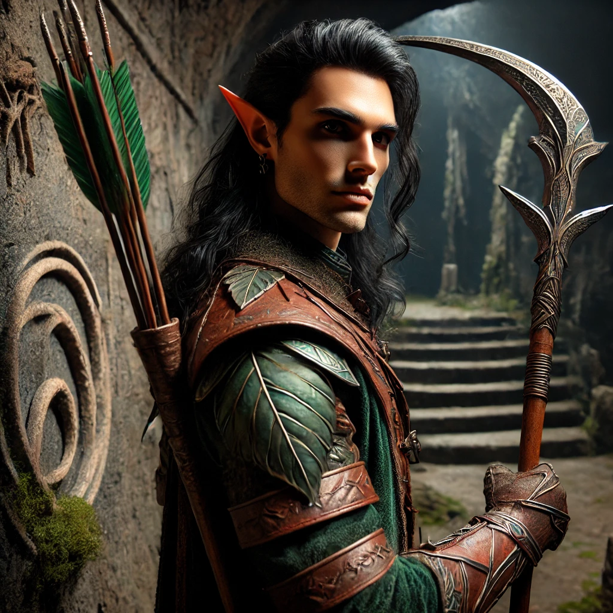
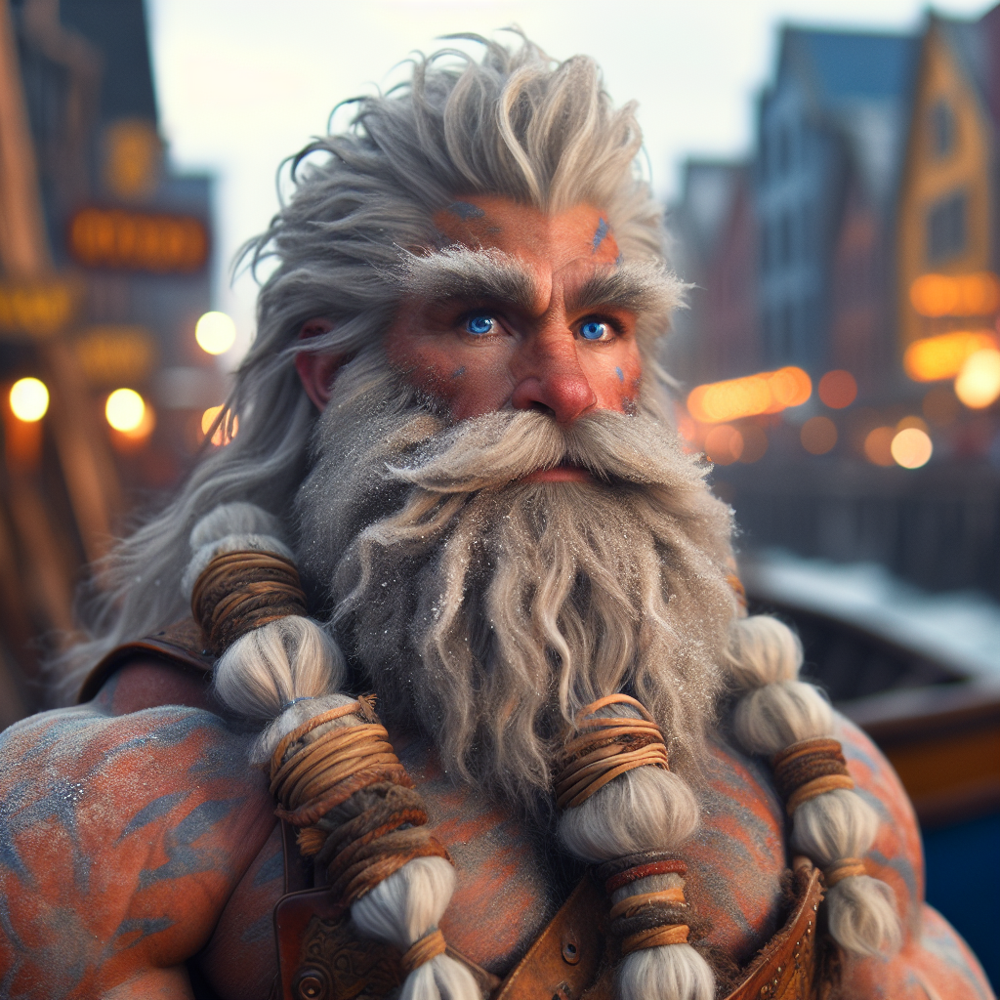

# Player Characters

<!-- Page-wide HTML goes here -->

<!-- end HTML -->

## Bolete 

She's a mushroom druid, on a quest, inexplicably, with Dr Indarhan Stone.

| | |
|-------------:|:--------------------|
| Picture      |  |
| Race         | Human (Thringenla)  |
| Class        | Druid               |
| Subclass     | ?                   |
| Homeland     | Greenrock Mountains |
| Age          | ?                   |
| Controller   | Adam                |

## Boudicca

| | |
|-------------:|:--------------------|
| Picture      |  |
| Race         | Dwarf               |
| Class        | Fighter             |
| Subclass     | Eldritch Knight     |
| Homeland     | City of Mines       |
| Age          | 205 years, as of 473 KD |
| Controller   | Charlotte           |

### Character Backlore

## Fëlu il'Raïk

| | |
|-------------:|:--------------------|
| Picture      |  |
| Race         | Elf (Ildarii)            |
| Class        | Ranger                   |
| Subclass     | Horizon Walker           |
| Homeland     | Jezier'Raïk              |
| Age          | 352 as of 473 KD (young for an Ildari) |
| Controller   | Jon                      |

### Character Backlore

Fëlu hails from the ancient Elven city of Jezier'Raïk and is a Fledgling *Deepseeker*.

While most adept with a bow, he has recently been learning the art of the glaive, and has inherited his grandfather Ilyenu's Moon-touched Deepseeker Glaive of yore.

His primary goal is to hunt as many Graxil as possible and locate splinters of Morě-Duar (the Deadmoon), thereby proving himself to the Deepseeker High Council. He has also been tasked with a secondary mission - to hunt and bring back to Jezier'Raïk a certain blue Dreamcursed suspected of playing a role in the resurgence of the Graxils.

Fëlu is quite good at hunting both Graxils and people if necessary, but not particularly adept at socializing.

## Dr. Indarhan Stone

He's a professor, on a quest, inexplicably, with Bolete the Thringen Druid.

| | |
|-------------:|:--------------------|
| Race         | Human               |
| Class        | Rogue, Bard         |
| Subclass     | ?                   |
| Homeland     | ?                   |
| Age          | 30 |
| Controller   | Mike                |

### Character Backlore

Dr. Stone's father was a professor of great renown. His mother unfortunately passed when he was a child.

## Torin Thunderridge

| | |
|-------------:|:------------------------|
| Picture      |  |
| Race         | Dwarf                   |
| Class        | Barbarian               |
| Subclass     | Totem Warrior           |
| Homeland     | City of Stones          |
| Age          | 235 years, as of 473 KD |
| Controller   | Matt                    |

### Character Backlore

Deep below the Earth, Torin found an axe bearing an old version of his family crest. 
It speaks to secrets he has yet to unearth.
Torin enjoys decapitating, eviscerating, and maiming his enemies in myriad grotesque ways.

He is the author of the [Tablets of Torin](AT-2-TabletsOfTorin.md)