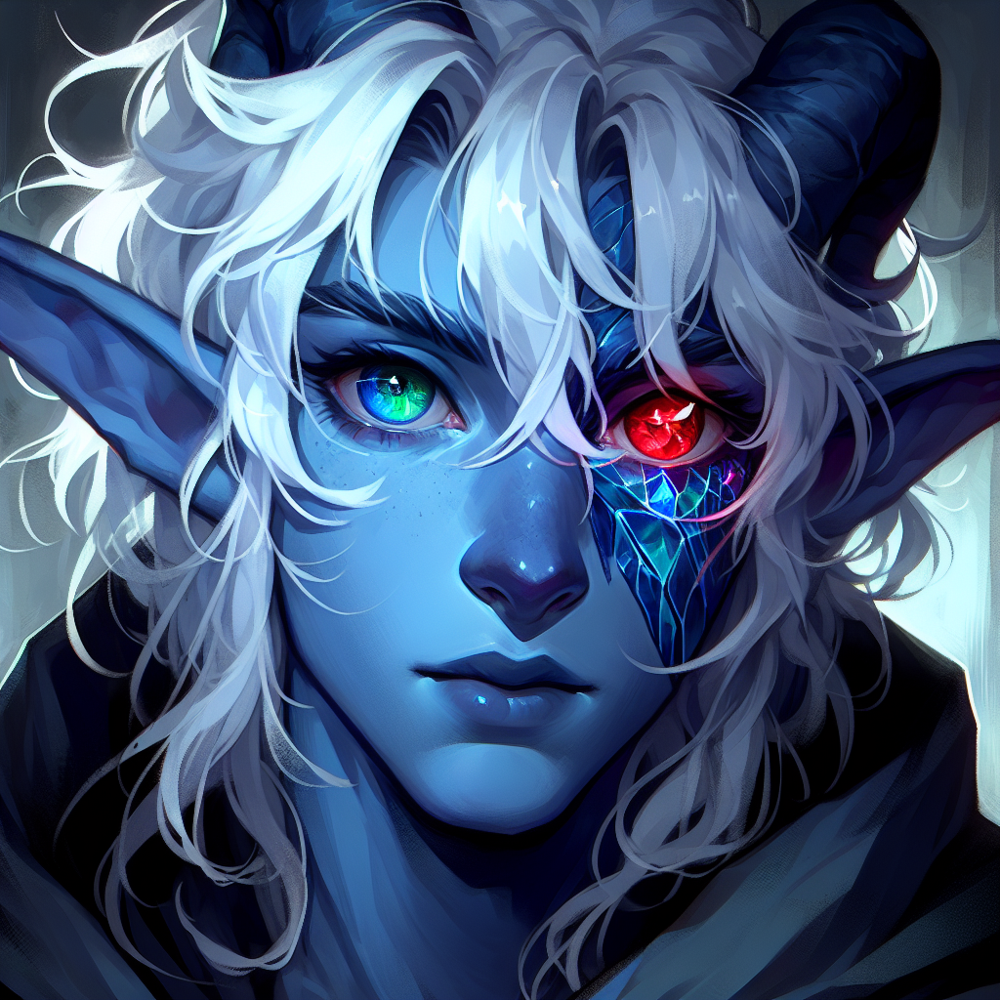
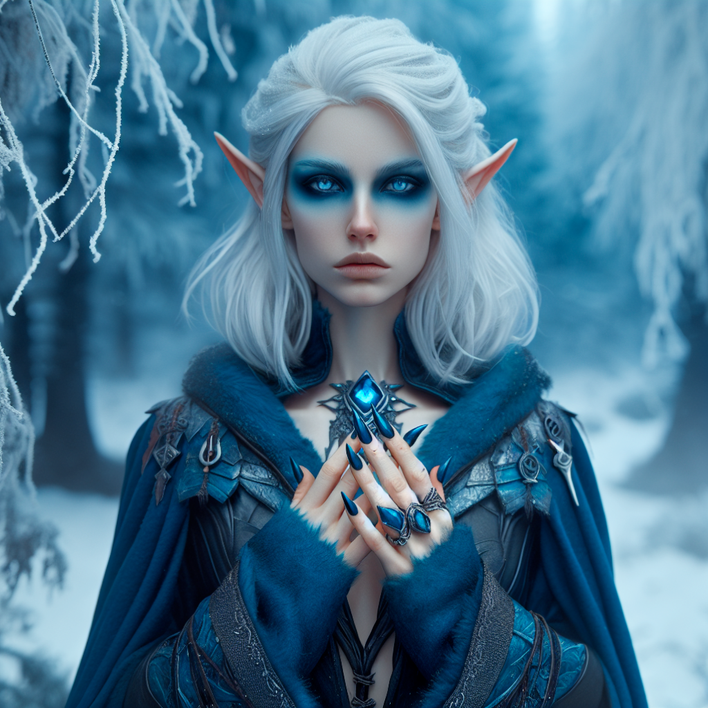
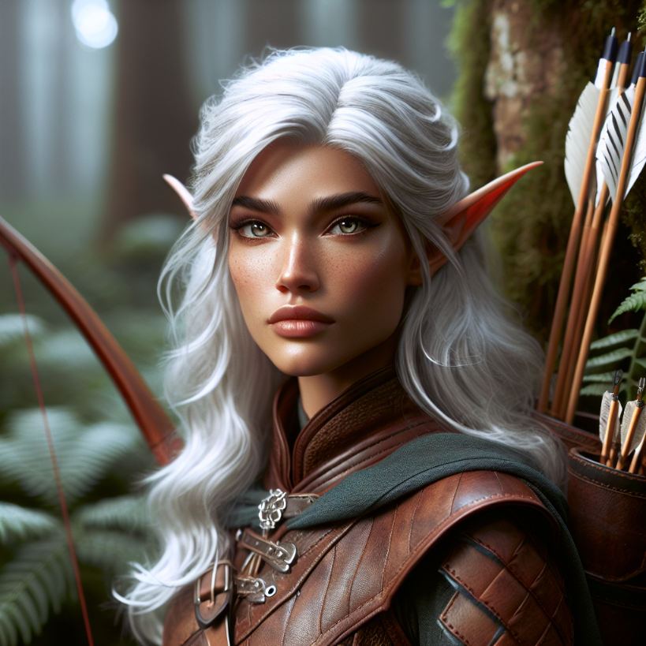

# Lightsong's Secret Lore
## Lightsong the Haunted

### Basics
**Character's Name**: Lightsong the Haunted  
**Race:** Dreamcursed (Tiefling of Fierna, born to Human mother, unknown father)  
**Class:** Bard, College of Whispers  
**Age(may be vague, like "young, middle-aged"):** 20s or 30s  

#### Physical Description:

- Medium build. Average. 
- Long tail. Medium horns poking through white hair. Blue skin. 
- One bright green eye. one bright red eye (usually thaumaturgy it green, i let loose while battling)

#### Do you have any quirks or odd personality traits?

Lightsong is generally pleasant, and happy to engage in banter, but often gets gloomy and quiet unexpectedly, or behaves erratically, especially when set off from something. Has what we would call PTSD. Often gets lost in thought. Often mutters to self, while awake or asleep.

#### What is your ultimate aspiration or goal?

People think I must want to prove myself as a noble Dreamcursed, or suspect me of some devilry - either is often the case among my kind. 
But I've long since stopped caring about proving myself. As for devilry, that's for you to judge...

##### I have two simple aspirations:
1. I want to find the man who killed and tortured my family. I would have his head. I would hear him scream.
2. I want desperately to heal my last remaining sister, Aria. She has the mute sickness, becoming frailer by the year. She hasn't talked since we fled the South.

#### What are your biggest fears?

1. That Lord Chakri and his son won't be stopped.
2. That I will lose Aria to the sickness, or to Chakri's son.

#### What was your past like?

##### Early Childhood:

- I grew up in a rural village of Ekryp, born to a single human mother. Rural Ekryp is known for peculiar Dreamcursed hatred and superstitions not found throughout the rest of the world.

- I remember little about my mother, though have/had vague impressions of her melodious voice, cheery face, and long hair.

- I started turning into a Dreamcursed when I was a toddler.

- One day, a couple of years later, my transformation nearly complete, a mob surrounded my house demanding to see my horns wihle I was out playing in the field.

- A friendly traveling merchant saw the commotion and told me to come with him. I was scared so I agreed. We rode toward the port, headed to Ashenstone, as my house burned behind us, presumably with my mother inside. The mob found no dreamcursed, as I was gone, and I assume my mother was killed. ***(She wasn't, but I don't know this. In fact, she arranged the whole thing and was relieved to think me dead).***

- The merchant and his wife took care of me for a year before falling on hard times and needing to give me up to the orphanages with tears in their eyes. At the orphanage I was called "Devil", "Bluey," "Demon," or simply "Boy". I do not remember my original name.

- After a couple of years in Ashenstone, alternating between being a street urchin and an orphanage rat, I was sent to an orphange in Drimmharbor, still very very young.

##### Formative Time among the Half-Orcs, in the South (I do not speak of this):

- Shortly after arriving in Drimmharbor, I was adopted by a half-orc caravan.  We went southeast into the Indip Expanse, heading to southern forests. The half-orcs were gruff, but they showed myriad kindnesses in quiet ways.

- We found a young half-elf girl on the trip south, not far from **Flaa**, passing an otherwise abandoned Elf sanctuary. She was/is probably a few years older than me, but was slightly less mature due to slow elf aging. (She would later gain (or regain?) the name Aria and i would gain the name Lightsong.) 
- At the time, Aria reminded me of my mother. Like, a lot like my mother. Other Elves and half-elves knew nothing of her, so she stayed with us after we tried finding her family for a little while. Aria and I immediately got along and our Half Orc family referred to us as siblings immediately. We liked to play innocent pranks.

	- Aria loved to sing, mostly nonsense about squirrels or birds, but her voice was beautiful (although kind of funny - everyone smiled when she sang, because she would sing such ridiculous stories and had a quick wit and would gently tease anyone and everyone. This sort of thing was very strange to the Half-orcs, but they began to enjoy it.)

- Our half-orc family made livings as woodcutters and provided hospitality services to Elf pilgrims.

- We learned half-orc nomadic culture and language, learned to respect forest and Elves.

##### A night of heinous tragedy

- As an older teenager / very young adult, my adopted half-orc family was led into a trap set up by an imperial logging company. The poachers then brutally violated, tortured, and murdered every last one of our clan, numbering close to 60 half-orcs dead in a single evening. This was not done by rogue poachers, but under the official command of the extremely high ranking Imperial Lord, Chakri.

- Chakri said had "special plans" for the Dreamcursed and his Sister, and vowed he would have us again one day. Me for "experiements" and Aria "for his son Jarodren. as a plaything" 

- With help of Elves who ambushed the loggers at the last minute, Aria and I escaped. We fled to Mulhong through torrential downpours, then made for Wuldan lands on merchant and fishing boats. Aria stopped talking entirely and developed a blank stare, eating little.

##### Recent past:

Aria has not spoken since the day of the attack. She is constantly ill, and I worry for her health. I fear she has "The Mute Sickness," for which I am seeking news of a cure and others who've had it. It is said it especially strikes those who suffer physical or emotional trauma. 

I leave Aria behind in a small Wuldan village in the farthest North, where she is cared for by shamans in the ice, a few dozen miles North of the Elf city of Kiv'la. They help keep her alive, but they sadly cannot return her voice to her, as much as they try.

For the last 9 years I've worked odd jobs and played as Bard around the Empire, usually laundering my travel through Crag and Sygassas or Princepta. 

I visit Aria once every year and stay for a month or three. I have just gotten back from my last visit. Aria is still not talking, and the shamans are at a loss, though they take excellent care of her. They hate the Empire and help us as fellow victims of the Empire's cruelty. Aria does not seem to have aged, as half-elves age slowly (though not as slowly as full-elves), but she is frail.

- I do not speak of Aria to anyone, nor of my Wuldan connections. Since joining my companions in Crag, I have let loose that I seek Chakri, but I guard Aria's existence as a dear secret. If Jarodren Chakri knew she was alive, he would try to find her.

#### What motivates you to get up every day?
- My sister Aria, finding news of a cure for the Mute Sickness, and seeking for any clues on Chakri.

#### Before finding yourself thrown into this adventure, how did you make a living?

- Since leaving the south after the attack, I've worked many odd-jobs, but becoming a bard - telling stories and playing the lute or accordion - has been my main stay. I even picked up some spell-casting in Wulda from the shamans! I also have done some fishing.
 - I said I was abandoned by my fishing crew and that's how I ended up in Crag, but secretly, a Wuldan ship granted my passage, and I came to Crag on a personal quest. (I have some middling  Wuldan connections, such as Cyr-Kan the Shipwright. I speak the Wuldan language poorly/brokenly)

#### How do you spend your free time?

- Practicing musical instruments and reading folklore. 
- Writing the day's activities in my journal (see https://ashenstone.quest). I like to keep notes on events, however mundane.
- Secretly plotting my next move and finding info on Lord Chakri and his son. I did not know his name until recently. His colors are White and Gold, and he has high religious standing within the Imperium. 
	- Chakri also has a scar diagnoally across his face, is extremely tall, and looked and acted extremely pleasant and friendly when he wasn't murdering, raping, and torturing.
- Since leaving Crag, I am once again seeking clues on the Mute Sickness

#### An old leprous beggar approaches you in the street asking for a spare coin. How do you respond?

- Sit with him to learn his story. Give coin if I have it. Tell him a story of my own. Sometimes, closer to the truth than those I tell others.				

---- 
### On Songhews and Lightsong's hatred of (most) axes.
Alright, if you'll humor me, some backstory on my hatred of imperial woodcutting implements, a treatment of a special Half Orc relic/tool called a Songhew, and origin to the name Lightsong.

Did I mention yet that I hate axes, longsaws, logging caravans, and mills? I avoid them even when it would be really convenient not to. I usually hiss softly and go into a morose state if I even see a longaxe or longsaw in a shop window or on the belt of a lumberjack. I will be prone to recklessness if an enemy uses one against the party. (I can be reasoned with, but I get irrational sometimes). I particularly despise the broad cruel axes wielded by the Imperium, and the saws used to destroy ancient sacred trees that should never be felled. I fantasize about setting fire to the mills that turns eons into pulp.... 

- I do not hold much love Dwarven style battle-axes, due to their facile resemblance to the poachers' mauls, and my memories of family's limbs bloodily separated from joints. As such I am usually very wary of them too, but can learn to tolerate them. I don't think I could bring myself to wield one.
 
There is, however, a type of axe I do not hate, but in fact I would gladly see again:

The nomadic half orcs of the southern forest used very special axes called Songhews. 

- Each axe was passed on for generations, treated with utmost care, and inscribed with runes of thanks for the forest. They were rarely if ever shared with folks outside the clan, even other half orcs, such as the pastoral ones of the hills, our clan's distant cousins. 

- Songhews have kindly looking halfmoon blades with notches, making whistling sounds in various pitches as they swing. 

- Each came with a thick but soft fiber blade guard for safe handling. 

- Using a Songhew for violence was unthinkable, and any who did so would be stripped of their Songhew and banished from the clan with the utmost sorrow. Their names are removed from the blade, 

- Only very particular trees were cut with Songhews, usually fast growing clonal trees whose trunks would eventually grow back or send up shooters, and sometimes days were spent deliberating on which trees the forest was signalling us to harvest honorably..

- Aria and I received a Songhew each from our adoptive Grandparents, with our names etched in the Half Orc runes on the blade, in the ceremony in which we were adopted into the clan. They were our most cherished possessions.

- It is actually this ceremony which gave me the name Lightsong. I do not remenber my original name and usually was called "Devil", "Demon", or "Bluey", prior to my adoption, or "Boy" by more kindly folk. "Lightsong" is the only part of my life with the Half Orcs I dare to share. I wear the name with pride, though I pretend I chose it for myself.

- Lord Chakri took our Songhews from us as prizes, thinking it interesting Half-orc elders would bestow their secret axes on a bastard Dreamcursed and a ditsy Half elf girl. I would have mine back. And I would restore Aria's to her.

---

Lightsong lore update 5/18/24:

- Lord Ylisyr Chakri has a son, Jarodren Chakri, who helped him gleefully with the atrocities against Lightsong’s half-orc family. This lordling would make Ewyin Corrack look a saint, scholar, and gentleman. (Ewyin redemption arc happens where he helps us kill this fucker? I leave it to you ). Also, Lord chakri promised Aria to his son as a wife before Lightsong and Aria escaped. No bueno. Fucked up.

- Lightsong thinks his half-elf sister Aria is just his adopted sister bc half-orc family, but she’s actually his slightly older real sister, he has no idea. He also doesn’t realize she’s older bc half-elf. “She always reminded me of my mom who was killed when I was 3”. There’s a reason she’s familiar. Aria ran away from mom at a very young age, Lightsong was conceived in sadness. Mom abandoned lightsong once he started turning, but he thinks she was killed. She's still out there. Remember, Aria is super secret and Lightsong will take a long long time to reveal her if ever. You may have to force the subject. Don’t do it too soon though Maybe Lightsong was a half-elf before Tiefling-ing, or maybe they have different dads and lightsong was full human. You can choose 

## Aria, Silent Seer

**Character's Name:** Aria.

**Race:** Half Elf.  

**Class:** Druid (Arctic) + Divination Wizard.  

**Age (may be vague, like "young, middle-aged")**: 33.  

**Physical Description:** 
- Pale, medium height, blue eyes.
- Wears hooded cloaks with downcast eyes.
- Unnaturally pale skin.
- Her blonde hair has turned icy white.
- Her eyes are a startingly mosaic of blue hues that seem to shift in the light.
- Pine Marten familiar, Kirjan.  

**Do you have any quirks or odd personality traits?**
- Aria is deathly quiet. She eats and moves little. 
- On certain nights, she walks for miles Northward, then comes back before morning and sleeps the next day. 
- She is not questioned, but Fi'arië never loses track of her general location.

**What is your ultimate aspiration or goal?**
- Aria's ultimate aspirations are entirely unknown.

**What are your biggest fears?**
- Unknown, but Aria goes great lengths to avoid axes.
- Aria is very protective of her Pine Marten familiar/dæmon, Kirjan, who is capable of speaking on her behalf, but does so only rarely.

**What was your childhood like?**
- Aria ran away from her parents when she was 5, on a trip to Flaa, at the edge of civilized Indip. It's unclear why. 
- Aria was held in stasis by an ancient elven magic she stumbled upon for 7 years, until she was adopted by a band of Unhorned a few day's journey Southeast of Flaa, in the Indip Expanse.
- It was the presence of kin that broke her out of stasis - the magic was originally devised millenia ago to protect Elves from near apocalyptic threats during the War of Descension. Only the presence of blood relations would undo the stasis spell. Unknown to Lightsong, he was the kin who undid this spell.
- Aria met Lightsong who was travelling with the Unhorned. She immediately recognized Lightsong as her kin who undid the spell, despite never having met him. She never said anything to him about this.

**What motivates you to get up every day?**
- Aria tends to a mysterious Scythe-blade inscribed with mysterious runes.
- Aria dutifully learns survival skills from Fi'arië, her Eladrin Shadow.
- Aria practices her druidcraft and divination magic with the other Ice Seers. The Ice Seers are not mute, but they speak little among themselves, sharing a deep understanding. Aria learns well despite not talking.

**Before finding themselves thrown into this adventure, how did you make a living?**
- Previously, A carefree girl who loved to sing and talk to birds.
- More recently, a silent student of the ice.

**How do you spend your free time?**
- Sitting alone, or with Fi'ariē, or Kirjan, or with the Ice Seers, with books of druidcraft and divination.
- Going on midnight jaunts to various sites in the icy wilds.

**An old leprous beggar approaches you in the street asking for a spare coin. How do you respond?**
- Aria does not know what coins are, so would probably be confused.

----
**Alignment**: chaotic good ultimately, but seemlngly true neutral to those who don't know her well.

**Background**
Haunted One
Feature: Heart of Darkness

Those who look into your eyes can see that you have faced unimaginable horror and that you are no stranger to darkness. Though they might fear you, commoners will extend you every courtesy and do their utmost to help you. Unless you have shown yourself to be a danger to them, they will even take up arms to fight alongside you, should you find yourself facing an enemy alone.

**Harrowing Event**

Prior to becoming an adventurer, your path in life was defined by one dark moment, one fateful decision, or one tragedy. Now you feel a darkness threatening to consume you, and you fear there may be no hope of escape. Choose a harrowing event that haunts you, or roll one on the Harrowing Events table.

- A monster that slaughtered dozens of innocent people spared your life, and you don’t know why.

**Personality Traits**
- I refuse to become a victim, and I will not allow others to be victimized.
- I don’t run from evil. Evil runs from me.
- I like to read and memorize poetry. It keeps me calm and brings me fleeting moments of happiness.
- I don’t talk about the thing that torments me. I’d rather not burden others with my curse.
- I expect danger around every corner. I'm ready for it.

**Ideals**
- I’m a monster that destroys other monsters, and anything else that gets in my way. (Evil)
- I have a dark calling that puts me above the law. (Chaotic)
- I kill monsters to make the world a safer place, and to exorcise my own demons. (Good)
- I like to know my enemy’s capabilities and weaknesses before rushing into battle. (Lawful)

**Bonds**
- A terrible guilt consumes me. I hope that I can find redemption through my actions.

- There’s evil in me, I can feel it. It must never be set free.

- I have a child to protect. I must make the world a safer place for him (or her).
	- *This isn't her offspring, but actually her younger brother Lightsong. Lightsong imagines himself Aria's caretaker, but she feels the opposite.*

- I keep my thoughts and discoveries in a journal. My journal is my legacy.

**Flaws**
- I talk to spirits that no one else can see.
- I assume the worst in people.
- I have certain rituals that I must follow every day. I can never break them.

## Fi'arië Seershadow

**Character's Name:** Fi'arië Seershadow

**Race:** Elf (eladrin/ethereal) (think semi-immortal countless millenia living tolkien elf, rather than multihundred year old dnd elf, mix in some cosmic/celestial mystery)

**Class:** Ranger - Horizon Walker, Level 15

**Age (may be vague, like "young, middle-aged")**: 3210.years old this past March. Fi'arië was born with the vernal equinox.

**Physical Description:** Olive skinned, silver hair (born this color, not a sign of age). If she were human, people would guess shes in her 30s. About 5'9". Like lightsong, she has two different colored eyes. One is blue, the other green. Nothing so dramatic as her Tiefling acquaintence.

**Do you have any quirks or odd personality traits?**
- I love sweets. Especially things with honey or berries.
- Wuldan Gin is my other vice.
- Im quiet and seemingly unempathetic. Its not my fault humans die so quickly and over such trivial matters. I hardly can even register who they are before they die.
- Ive been known to meditate for weeks at a time without eating or drinking anything. One time I went two spring months listening to the Moons in a Spruce tree and found not one but two chickadee nests in my cloak when I stood up.

**What is your ultimate aspiration or goal?**
- To shepherd my charge to her destiny, and protect her on her way. I cannot leave the circles of the world until I do.
- To finish my record of the moons - a scholarly pursuit if I do say so myself!
- To find wellsprings of Aberrated on this Sphere, and dismantle them.
	- Like the Graxil, the Aberrated are interlopers. I'll leave the Graxil to the Deepfinders.

**What are your biggest fears?**
- That the Ice Seers of the North will go extinct. The Seers are critical connective tissue. There are other worlds and mechanisms at work even my grandmother cannot explain, and all is for naught if the Seers here die out...
- That my brothers will fail on their quest. I have not seen them nor even communed with them yet this century, and I've been getting increasingly worried.

**What was your childhood like?**
- It's been thousands of years. I remember a different world. There were ruins everywhere. Now, few if any remain, all having crumbled to dust. There were also more volcanoes then. 
- I was raised by my grandmother and her sisters. My parents left the circles of the world before I even knew how to walk. 
- I remember the waves of human migrations from the South. I remember meeting children who now grace the history books as great heroes of old. Most were not even close to as noble as theyre presented. Some, including the best of them, are not told of at all.
- Ive learned and forgotten countless human tongues. I prefer to speak my own tongue, but the current common speech was easy to master.
- My grandmother taught me of the time before the Moonfall. She left the circles of the world with her sisters over 400 years ago, around the founding of the Kaldrinic Dynasty.
- I made friends with a Clan of the Old Kyver as a youngling. I do not know what became of them.

**What motivates you to get up every day?**

- To protect my current Seer, Aria. She is young and traumatized, but shows great promise.
- The thrill of the hunt for Aberrations, Undead, and within the last few decades, Imperial Paladins.
- The thought of discovering a new sweet or pastry. Humans are always coming up with new tasty things. Its the only thing that they seem able to surprise me with.
- I do not put any stock in Lightsong's search for cures of the so called mute sickness. Aria will speak again if and when she wishes. Speech is overrated, anyway. Still, I dont have any interest in dissuading him. 

**Before finding themselves thrown into this adventure, how did you make a living?**
- Dutysworn as a Seershadow of Kiv'la to protect the Seers and shepherd individual seers to their destiny. 
- As of less than a decade ago, I again have a Seer to Shadow - Aria. The last one, Rendon, died on me after a measily sixty years from "old age". He was only 85! Aria has already surpassed him in her early thirties - still a babe, but I'm impressed.

**How do you spend your free time?**
- Eating pastries and drinking the strongest wuldan gin (it takes a lot to get a 3000 year old elf drunk). I talk more when Im drunk. I have a thing for strong dwarves, men or women.
- Listening to the Music of the Moons.
- Hunting aberrations and undead in the Northern Icelands. My efforts keep them at bay, but theyve both become slightly more numerous this year, which is cause for some concern, especially when they meld ...

**An old leprous beggar approaches you in the street asking for a spare coin. How do you respond?**
- I give them some food, water, and a ward against Aberrations.

----
**Alignment**: Neutral good

**Background**
Fi'arië is an Eladrin Elf - on this planet, exceedingly few are aware of her kind. Eladrin Elves are called by those who know them the "True" Elves - they do not seem to age at all, and can live many millenia. They are deeply connected to the "Circles of the World" - the whole of the cosmos, as the Eladrin see it. It is said they can hear the Moons "sing," and that the song is loudest during Aurora storms.

Outlander
Feature: Wanderer

You have an excellent memory for maps and geography, and you can always recall the general layout of terrain, settlements, and other features around you. In addition, you can find food and fresh water for yourself and up to five other people each day, provided that the land offers berries, small game, water, and so forth.

- Fi'arië knows more about the living land than most anyone; she is not aware of her excellence in this matter, she simply takes her knowledge for granted

**Personality Traits**
- I watch over my friends as if they were a litter of newborn pups.
	- At 3210 years old, it makes sense that she would feel this way.
- I have a lesson for every situation, drawn from observing nature.

**Ideals**
- Nature. The natural world is more important than all the constructs of civilization. (Neutral)
**Bonds**
- An injury to the unspoiled wilderness of my home is an injury to me.

**Flaws**
- I am slow to trust members of other races, tribes, and societies.
