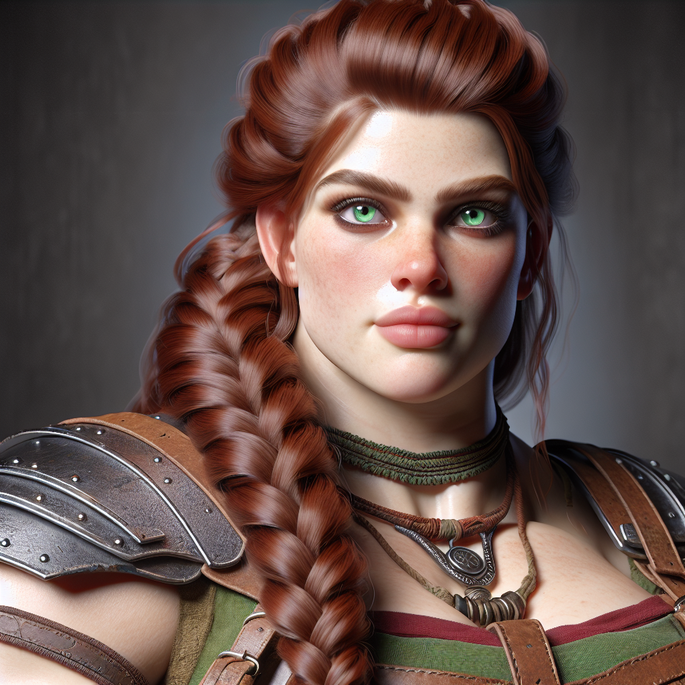
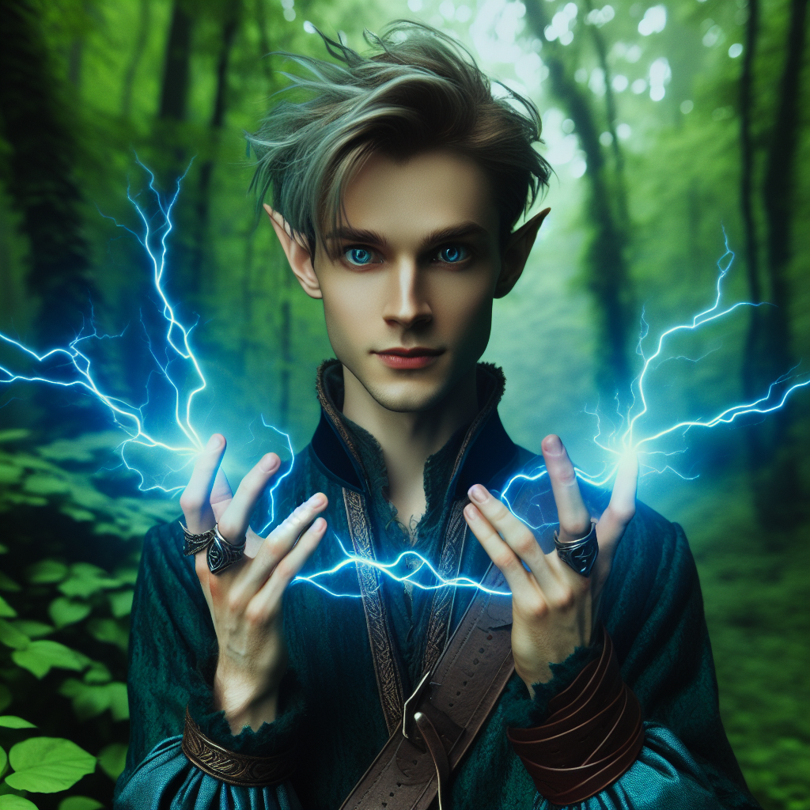
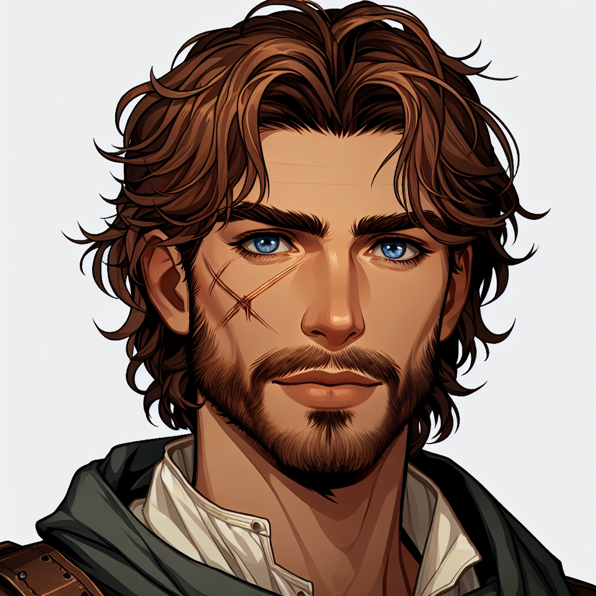

# Lightsong's Journal
## Companions

> _Ah, my compatriots. I don't fully know what to think of them._  
> _Below is the information I have on them, which I will update with time._.  
> _- LS_

<!-- Page-wide HTML goes here -->

<!-- end HTML -->

### Boudicca

| | |
|-------------:|:--------------------|
| Picture      |  |
| Race         | Dwarf               |
| Class        | Fighter             |
| Subclass     | Eldritch Knight     |
| Alignment    | Unknown             |
| Homeland     | City of Mines       |
| Age          | 175 years, as of 442 KD |
| Controller   | Charlotte           |
| Impressions  | _Generally good natured, but she is willing to kill... perhaps too willing. She has done right by me though, and I owe my life to her a few times over. She is strong, and wields the powers of Death. I am glad to count her as an ally._ |
| Status       | Alive                |

#### Character Backlore

### Flim Flam of Alk'Sira

| | |
|-------------:|:--------------------|
| Picture      |  |
| Race         | Wood Elf             |
| Class        | Mage                 |
| Subclass     | School of Evocation  |
| Alignment    | Unknown              |
| Homeland     | _Alk'Sira_           |
| Age          | 63, as of 442 KD     |
| Controller   | August               |
| Impressions  | _A powerful force of destruction. We get along well enough! He is simultaneously wise and youthful. I am not sure if he holds any secrets, but he does not really seem the secretive type._ |
| Status       | Likely deceased      |

#### Character Backlore

### Hazar Cora

| | |
|-------------:|:--------------------|
| Picture      |  |
| Race         | Human                |
| Class        | Rogue                |
| Subclass     | Assassin             |
| Alignment    | Unknown              |
| Homeland     | Ashenstone City      |
| Age          | 28, as of 442 KD     |
| Controller   | Mike                 |
| Impressions and notes  | _I did not like him at all at first - I could tell he was a noble (formerly, anyway) on first sight, and I swear I've seen him Ashenstone in the ritzier districts. However, I was impressed by his restraint in the Warehouses of Crag, and I have grown fond of him, despite our bickering. Very curious to find out he was once a lighthouser - this has elevated my opinion of him quite a bit, despite the apparent fall from Grace he and the other Lighthousers allude to. He shares in our goal to bring down the Beast of Ashenstone, Chakri, and for him it is also personal. I wonder what other secrets he nurtures._|
| Status       | Alive                |

#### Character Backlore

It is likely he was a bastard of none other than Ylysir Chakri, our nemesis, whom we killed.

### Lightsong

| | |
|-------------:|:--------------------|
| Picture      |  |
| Race         | Dreamcursed (Tiefling of Fierna)  |
| Class        | Bard                |
| Subclass     | College of Whispers |
| Alignment    | Chaotic Good        |
| Homeland     | Ekryp (original), The Indip Expanse (Adoptive) |
| Age          | 30? Ish? as of 442 KD  |
| Controller   | Jon                 |
| Impressions  | _Me!_ |
| Status       | Alive |

#### Character Backlore

I was born before 420 KD in Ekryp, to a single human mother, in a small bucolic village near the coast. As a very young child, I began turning into a Dreamcursed. A mob killed my mother while she was trying to protect me, and a kindly merchant, Sheb (or Shem? Or Shen? It's been a while), got me away to Ashestone City.

Eventually I ended up in Indip and was adopted by an indigenous Half-orc (we prefer the term "Unhorned") clan who nomadically travelled throughought the forests of the Eastern Indip Expanse.

> See [Lightsong's Secret Lore](Journal-99-Lightsong-Lore) for much, much more.

### Torin Thunderridge

| | |
|-------------:|:--------------------|
| Picture      |  |
| Race         | Dwarf               |
| Class        | Barbarian           |
| Subclass     | Totem Warrior       |
| Alignment    | Unknown             |
| Homeland     | City of Stones      |
| Age          | 205 years, as of 442 KD |
| Controller   | Matt                |
| Impressions  | _He could fight a boulder and win. I am truly happy he's on my side. He has shown me kindness, but I am more the distraught by the corpses he has left mangled in his wake, especially with that cursed Axe of his. He can show restraint when need be, and has listened to my counsel._ | 
| Status       | Alive |

#### Character Backlore

Deep below the Earth, Torin found an axe bearing an old version of his family crest. It speaks to secrets he has yet to unearth.

## One-off Characters

### T.F. the Monk

| | |
|-------------:|:--------------------|
| Picture      | |
| Race         | Half-elf |
| Class        | Monk                |
| Subclass     | Path of Elements |
| Alignment    | Neutral Good        |
| Homeland     | Unspecified Mountain Range |
| Age          | 200 or so. Aged but formiddable   |
| Controller   | Rajan Burathoki     |

### Herman Miller

| | |
|-------------:|:--------------------|
| Picture      |  |
| Race         | Human |
| Class        | Fighter                |
| Subclass     |  |
| Alignment    | Neutral Good       |
| Homeland     | Taynuilt |
| Age          | 30   |
| Controller   | Nick Ellsworth |

