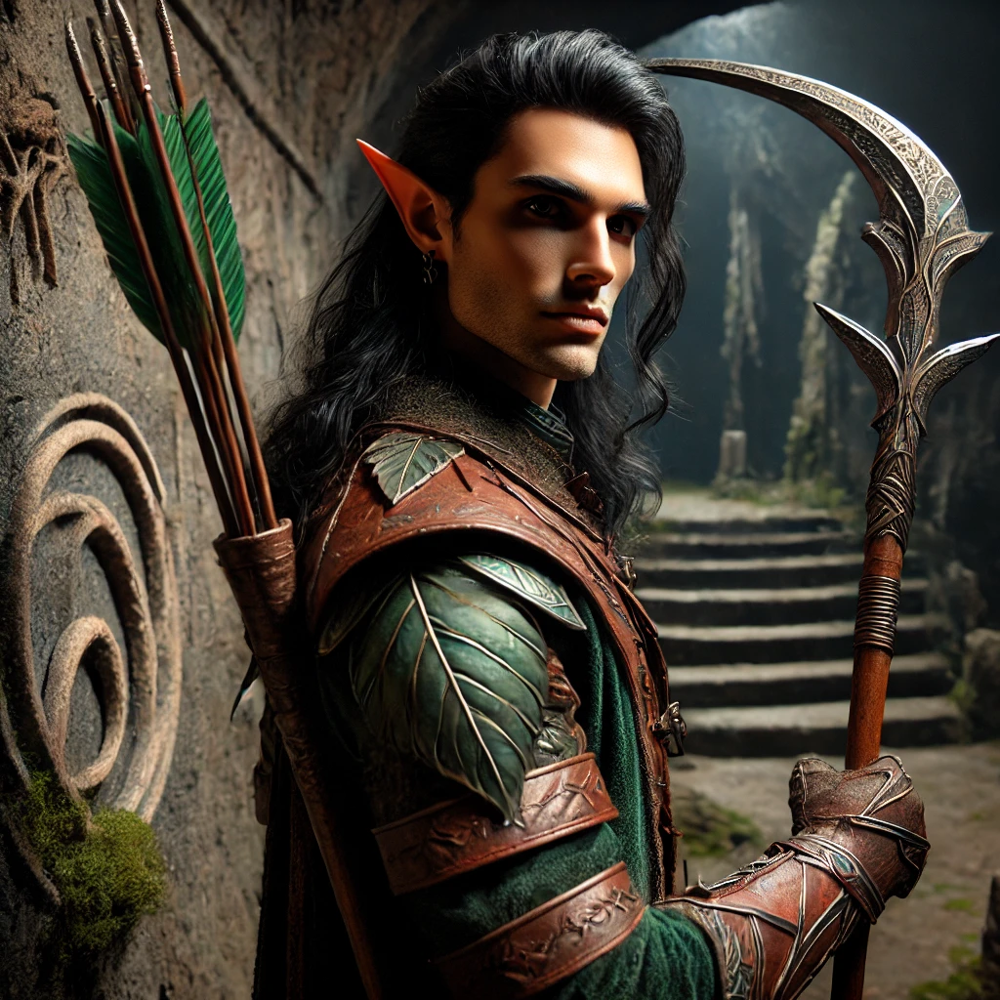

# The Ashenstone Trail  

## Characters

<!-- Page-wide HTML goes here -->

<!-- end HTML -->

### Boudicca

| | |
|-------------:|:--------------------|
| Picture      |  |
| Race         | Dwarf               |
| Class        | Fighter             |
| Subclass     | Eldritch Knight     |
| Homeland     | City of Mines       |
| Age          | 175 years, as of 442 KD |
| Controller   | Charlotte           |

### Fëlu il'Raïk
| | |
|-------------:|:--------------------|
| Picture      |  |
| Race         | Elf (Ildaari)       |
| Class        | Ranger              |
| Subclass     | Horizon Walker      |
| Homeland     | Jezier'Raïk         |
| Age          | 352 (young for an Ildaar) |
| Controller   | Jon                 |

#### Character Backlore

Felu hails from the ancient Elven city of Jezier'Raïk and is an Aspiring *Deepseeker*.
His primary goal is to hunt as many Graxil as possible and prove himself to the Deepseeker High Council. 
While most adept with a bow, he has recently been learning the art of the glaive. 

Felu is quite good at hunting, but not particularly adept at socializing. 

### Torin Thunderridge

| | |
|-------------:|:--------------------|
| Picture      |  |
| Race         | Dwarf               |
| Class        | Barbarian           |
| Subclass     | Totem Warrior       |
| Homeland     | City of Stones      |
| Age          | 225 years, as of 462 KD |
| Controller   | Matt                |

#### Character Backlore

Deep below the Earth, Torin found an axe bearing an old version of his family crest. It speaks to secrets he has yet to unearth.
Torin enjoys decapitating, eviscerating, and maiming his enemies in myriad grotesque ways.
