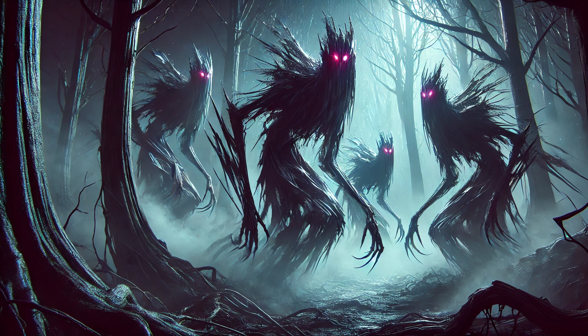

# The Tablets of Torin
> _Prelude to the Ashenstone Trail_

What a strange night, the night we fought Chakri. I knew taking on that monster would be no small feat, but I never expected taking him down would have consequences that would last these past three dozen years. After the battle in the cave we lost Flim Flam in that plaza of shimmering lights, I wonder to this day where he might be. Confused and bewildered we found ourselves on a hilltop that overlooked Lauge Fuir. Yet, as we looked out from that hill across the city, it was clear that something was wrong. We looked upon a city in flames in multiple places, an eerie sight to behold, more damage than a simple riot would cause. It was then my ancestors' axe whispered in my ear once more before going silent for so many years.

“Swirly dark tide, deep rhythmic humming of the maelstrom, pop pop goes the weasel, now flowing, rush, cascading into the world”

We endeavored to head back towards the city to find out what happened, but things on the road were chaotic as we found ourselves pushing against a tide of dilapidated refuges. I asked one old man what happened and his reply:

“Tis a terrible thing my lords, ghost! Ghosts in the night! They say they came flowing from the earth! Blood Blood! Blood in the street! Run, for your lives!”

Suddenly a formation of Copper Keep Armed guard swept down the road. Behind the scouts  the Dutchess Leylish pressed forward. She explained what transpired within the city walls after we disappeared from the citadel's fourth floor. At first  there were reports of an uncontrolled riot within the city center. Chakries forces moved into the city to suppress the violence, which seemed to go smoothly at first. But then reports of strange rioters began to reach my ears, dark drunken figures that seemed to emerge from the ground, pass through walls, and killed soldiers on sight. Shortly after these dark spirits began attacking my guards in the basement of the castle, We had no choice but to abandon the copper keep with as many forces as I had on hand and run. The duchess looked at us with sad eyes, “The city is lost, whatever role you may have played this evening, I suggest you do not return to Lauge Fuir, I have reports from messenger pigeon that this is not an isolated event, cities across the continent are awash with dark sprites and scenes of destruction. My best council is to return to your homes and protect your home cities before they too are overrun!”

At this point there was no choice but to split the party. I said my goodbyes to Budica, Lightsong, and Hazar and quickly traveled back to my home, the city of stone. We were able to fend off the dark spirits, known to my kind as the Graxil and stabilize the city. The fighting with these dark creatures became an unending struggle which claimed the lives of many dwarfs along the way.

For so many years the struggle against the Graxel has gone on this way. Across the land, small towns are overrun and abandoned, large cities have stabilized with much bloodshed, but were forced to pull back within their fortified districts. The empire itself lives on, but was forced to abandon its further outposts and return its forces home to help defend its major cities. A darkness has spread across the land, our Dwarven scholars have deemed the dark days with a title, the time of “the shadow plague”.

After many years of struggle with the Graxil I grews restless. The toll of the shadow plague has been heavy on the dwarven people. We have almost completely lost control of our underground domain, and are forced to make due on stores, a meager living surviving on hunting mostly. Trade is greatly limited and traveling the landscape safely requires an armed guard to protect from roaming swarms of Graxel.

All this time my ancestors axe hung silently in the wall of my beadroom. Silent all these years, since the incident, a reminder of the Role I played in unleashing this plague across the land. For months I began to toss in turn in my sleep, having strange dreams of ancient times that where not my own. Then one night I awakes from a dream to hear the voice of the axe whispering once again.

“Once a part this axe played in the dark deeds of the moon, greed, guilt, and power. Cork the bottle and this plague will end, look to the south, those that survived the Inquisition of Horns will remember whispers of a moon shards sister.”

I consulted the scribes in the great granite library of the city of stone if ever there were tales of a moon shard left somewhere in the south. Indeed, it seems that the dwarven warriors sent to support the half orcs of Indep during the Inquisition of Horns brought back rumors that the Half orcs held secret knowledge of a long forgotten artifact, these orc shamans are rumored to knowledge of the fallen moon shards, and the root of these Gaxel. Perhaps there, in the southern lands, I could find answers to help find a way to end this dark plague.

Thus I left the city of stones with a small elite guard of a half dozen warriors. Traveling south towards the land of the Half Orcs. I also sent word to Budika, at the city of Mines, to join me on my quest. The opportunity to make right our past mistakes spurred her impetus and she left to join me at once. We traveled separately by boat across the Korren Sea and met at the city of spires. From there we joined forces and headed south on foot with a dozen dwarfs towards the ancient land of Indep.

The road south was hard on the posse. The unprotected wilds are now the domain of Bandits, Dangerous Wildlife, and of course the ever present threat of Graxil. We lost 3 in the marrow mires, and another 4 along while traveling through Mulhong. Tonight we must make camp soon, with only five of us left in the group, but hope remains that we may be close to our goal: To end this flood of Graxil once and for all.

## 1/28/25 - Session 0 Synopsis

- Torin (Matt), Boudicca (Charlotte), and three Dwarven companions (NPCs) encounter a druid, Bolete (Adam), and a professor of antiquities, Indarma Jones (Mike). All parties are mutually suspicious at first.
- They are soon overrun by Graxil.
- A young Ildarii, Fëlu of Jezier'Raïk (Jon), comes from the shadows to assist, having been on the trail of the Graxil since earlier that day.
- The band of Graxil is defeated. Boudicca and Torin tell of their plan to find another splinter of the Deadmoon to see if they can "plug the leak." Fëlu admits his task is aligned, and would also like to find a certain blue Dramcursed Tiefling for his role in the release of the Graxils, also suspecting his new Dwarvish companions as complict.
- Bolete's and Indarma's motivations are less clear, but they seem generally willing to travel with the new group.

__The Adventure Begins!__