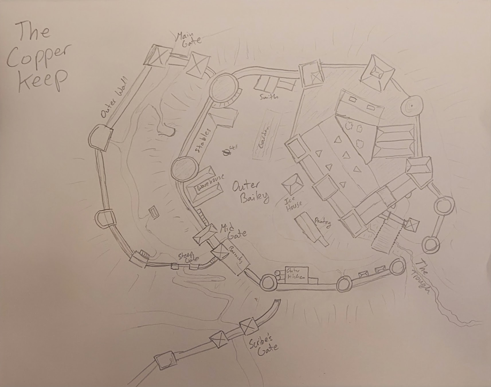
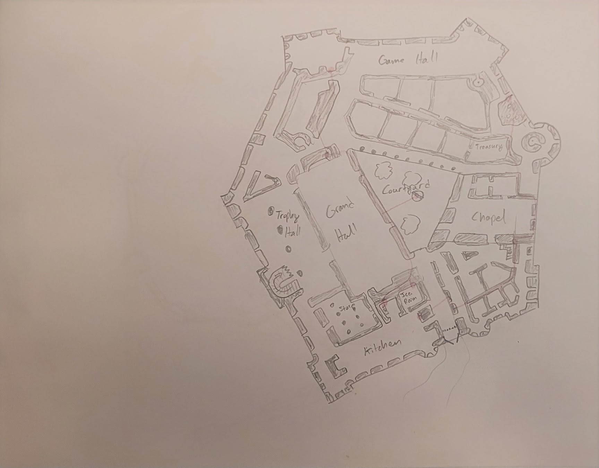
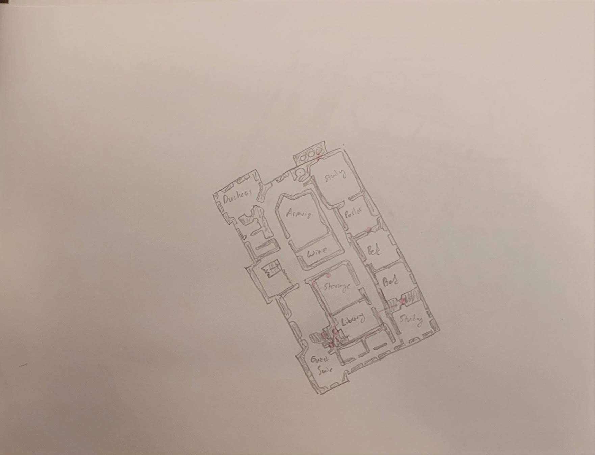

# Lightsong's Journal - Chapter 2-VII

> _Continued from [Lightsong's Journal, Ch 2, VI](Journal-2-VI.md)_  
> _Earth date: 12/13/24_  

It is the day. The day we slay the beast, Ylysir Chakri. 

## __Wenzday Morning__

### Heading out for the day

We have a spot of banter in the morning. Hazar and I argue the ethics of spilling brains and peeling back kneecaps.

Ancient trees along the boulevard! How lovely. 

As we walk toward the Southern Half of the city, the distinct stream of imperial soldiers greets us... not Chakri's men, perhaps, but here because of his machinations. 

Well, my companions Hazar and Torin are truly making a word salad of this interaction with the guards. 

### Meeting at the Copper Keep

Yes, we are back in the small tunnel. Loric will meet us soon. 
The Beast. His presence. I feel it. It approaches.

We are in the tunnels now. Dusty bottles abound. Torin grabs one, opens it, and takes a swig.
I... wouldn't have advised that. 

Thirty bottles! My party members take some, interesting I suppose. 

Boudicca and I perform a blood oath - I will not heal anyone but our fellows. Ouch.
Hazar keeps running his mouth about this Willem guard. I don't think I ever quite paid attention. 

Passages within the walls of the Copper Keep. 

#### Beat Bastard Ylisir's schedule
1. He arrives
2. Spends a few hours with the Dutchess
3. Cathedral at the Church of the Mother
4. Dinner with the Knights of the Valley
5. Private Appointment
6. Back at the Copper Keep






#### The stones from Shaheila
Loric gives us each a matte black stone with a dancing schedule. Each make a Lynnish ensemble.

Cryth, Bagpipe, Sham - oboe like thing, Drum, Harp.

We must find out what happened to her son. 

## __Wenzday Afternoon__

#### Through the castle to find a better weapon

Short bow tells me I will find a good weapon. Northeast. First floor.

We bribe the guard. Sort of. The rest isn't worth talking about. We have bigger fish to fry. 

Looks like we've killed an entire hour in the castle. 

#### Up to the top floor

I once again don't care about this man Willem. 
I see not why Hazar bothers him.

How might we escape? And where shall we lie in wait?
My blood boils, my blood stirs. 
May chaos take the world, and may it take Chakri first.
Down the storage room.

## __Wenzday Evening__

#### We hear the beast

I tell them of the time in the Forest. They deserve to know that at least.

Marquil is still alive and about. Drat.
We await. 

I squeak to investigate, but realize how I'm squeaking and come back. Hazar and Torin identify a guard... and dispatch him, fast. Too fast.

Block the spiral staircase - Bouddicca. 

Into the passageways.

We hear the beast talk to his man Marquil.
He almost drinks teh wine
Louissa Corrack. She led Chakri into Balnourial.
Chakri casts some unholy magicks against Louissa.
He slices Louissa's necklace.

"Only in Darkness can stars shine?"
Louissa to be one of his bright stars?
"I know the gifts we must accept"
What the FUCK is he doing to her?

"My lady, you've seen the darkness. You've seen its inevitability"

Oh. He has a thing for Louissa. 
He's... giving her some dark energy.
I HATE THIS MAN.

She grimaces at the name 'wildflower'.
I understand. This man believes himself above all. He believes all is justified. 

Interesting she doesn't refer to him by his first name. Ylisir. 
Too nice a name for too beastly a man. 

He took a swig of the poisoned wine.

It looks like the riot has begun...

Hazar takes the first leap out into Chakri.
HERE WE GO.

# Confronting the Beast, High Lord Ylisir Chakri

## In Charkri's Copper Keep Quarters
Well, it happened so fast but it seemed that we managed to kill him. 
Instead... though... we get sucked into the void. 

> _Earth date: 12/20/2024_

## In the deep dark depths...

Boudicca tells us that this artificial, 
slightly bioluminescent tunnel, but this is very clearly a dwarven mine.

We reach a fork. Hmm.. I do see tracks leading to left.
The bow also points us toward the Left. Let us find our vengeance.
Torin does a gnarly parkour kickflip in the direction of the tracks... nice. 

We enter into a large room, very dark, running water.

How old must this old place be? I wonder. 
My compatriot Torin deduces that this looks far older than any Dwarven city, 
and this hasn't been maintained in perhaps centuries!

Boudicca tastes it. She says its wonderful.

Ohhh shit there is a screech. WHAT IS THAT! THERE ARE TWO.

### BATTLE IN THE DARK

Forms of shifting, pulsing shadow encircle us. I count three. 
I've not seen something like this before, though perhaps Fi knows more.

Oh god, these things... what power compels them? I fear the end.
What a corrupted wail.

I ALMOST DIED AGAIN

### After the battle, deeper into the halls.
My bow tells us to go across the creek and to a small door on the right.
I help Torin open the door... interesting that my strength added to his is what we needed!

Hazar, the scoundrel, runs into the room. On a dais, we find a gleaimg **hiss** giant Axe.
Hazar picks up the axe... I choke back bile.... but what is this? It's Torin's family crest?
My visceral disgust for axes is replaced with awe and curiosity. 

We see imagery, in the abstract, reminiscent of those shadow-fiends. 
Bootprints now, oho!

And now... a mural? Some humanoid.. with shadow tendrils?

We see two guards...? There's a big stone door. 

"We have been commanded not to attack you."
"We will say no more"

We walk down into a chamber.... we see a stalagtite.
At the bottom, Lord Ylysir Chakri.

### CONFRONTING YLYSIR CHARKRI, PART II

What are the luminiscent wall carvings? To the right? 
A Mural, carved humanoid figure.
Something of the Holy Reagant?

"WHAT ARE YOU ABOUT?"

Oh... he does not look human...

What is the monster? THis man whose agents level the Indip Expanse?

There is chanting...

Marquil, again. Doesn't seem too upset at us.

"Do you know what these stones are?"

... our friend Boudicca just flatulated! That's quite the jest.
A splinter of Almak? The Deadmoon?
Chakri knows far more than I thought...

Chakri doesn't even remember the night that still shivers my spine.
The night when he, his son, and his men killed everyone we loved...
Unforgiveable. Just another day for him. 

He points to the stalagmite and stalactite that are nearly touching.

"When these touch, the darkness will return"

This "stalagmite," this splinter of Almak, that the beast calls Nira - 
it must be destroyed. It must be put to rest - all these millenia it's been pulsing here in the dark...

I call upon the powers of the sky - the sky from which this splinter fell - to give the Deadmoon a final rest.

Marquil - I like him. I hope he will yield before it's all over. 

#### The Battle Begins

I continue to attack the stone with thunder... my companions spring to action. Boudicca knocks Chakri down, and we do alright for a bit... but Chakri gets up and nearly does me in. Then he hits Hazar! He's down!

Things are not looking good.

The moon-shard pulses... I feel horror beyond horrors.. and everything goes black.

The following I learn after:
```
- An adept falls and in its place emerges a Graxil.
```

The sound of the skeleton stones awaken us.
The stone explodes. Big boom.

#### The end of the Battle
Shaheila's son is with the church. 
Hazar and Boudicca take swings at Chakri.
Neuranu is coming?

We have to stop him?

"Rest now with the splinter of the moon, you Bastard Beast - you'll never have her"

Torin slices right through his neck, with both of his axes, symmetrically.

The place is going to collapse! We get hit by stones. 

I use the dust, and we are compressed and expanded inexplicably... then sent back... somewhere?

This place is unfamiliar... a stone door. We go through.

We arise into a wooden glade.